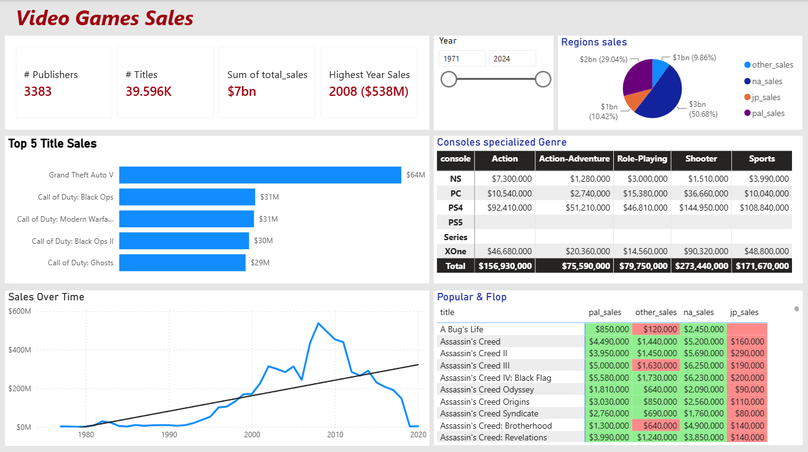

# video-games-sales-powerbi
An interactive Power BI dashboard analyzing global video game sales trends, regional performance, and top-selling genres.
# Video Games Sales - Power BI Dashboard

## ✨ Quick Preview

## 📌 What is this project about?
I built this dashboard to analyze global video game sales from 1980 to 2024. The main goal was to help publishers understand which regions (North America, Europe, Japan and others ) perform best and which game genres dominate each market.

## 🛠️ What I Did (The Technical Part)
* **Data Prep:** Cleaned the raw data and handled missing values using Power Query.
* **Smart Tables:** Created a dedicated table called **"Popular & Flop"** to instantly filter games based on their sales performance.
* **DAX & Dynamic Formatting:** Instead of using basic rules, I used advanced DAX measures combined with **Field Value conditional formatting** to dynamically color-code the cells based on performance thresholds. This keeps the layout clean and executive-ready.
* **UI/UX Design:** Kept the dashboard simple, clean, and structured so any stakeholder can find insights in less than 5 seconds.

## 💡 Key Takeaways
* North America (NA) and Europe (PAL) are the absolute heavyweights in sales volume.
* Japan has a completely different taste—Role-Playing games thrive there much more than Action/Shooter games compared to Western markets.
* Using custom DAX formatting made the grid much more scannable than regular raw numbers.

## 📂 How to Explore
1. Clone or download this repository.
2. Open the `video-games-sales-powerbi.pbix` file using Power BI Desktop.
